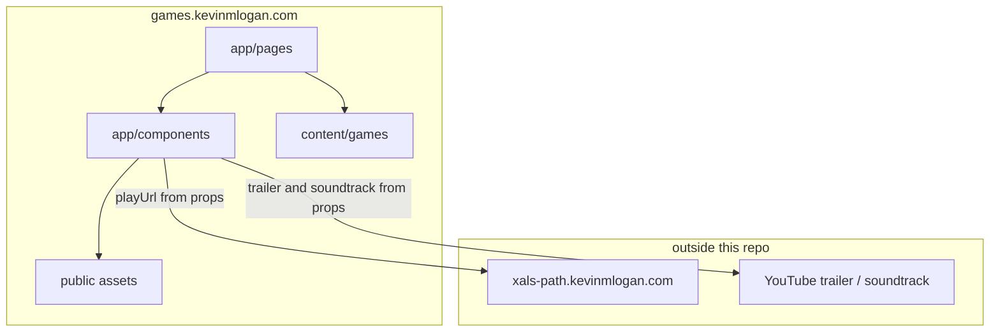
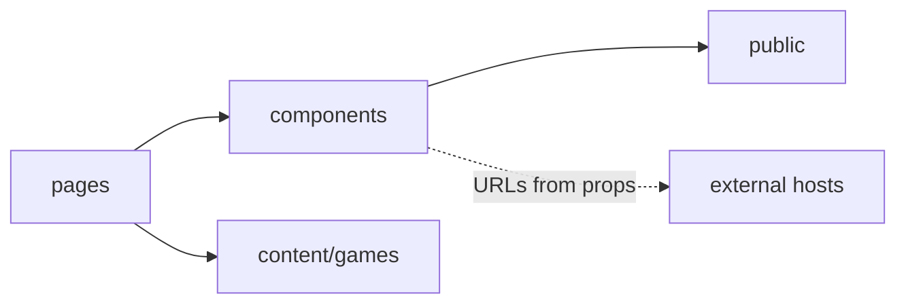
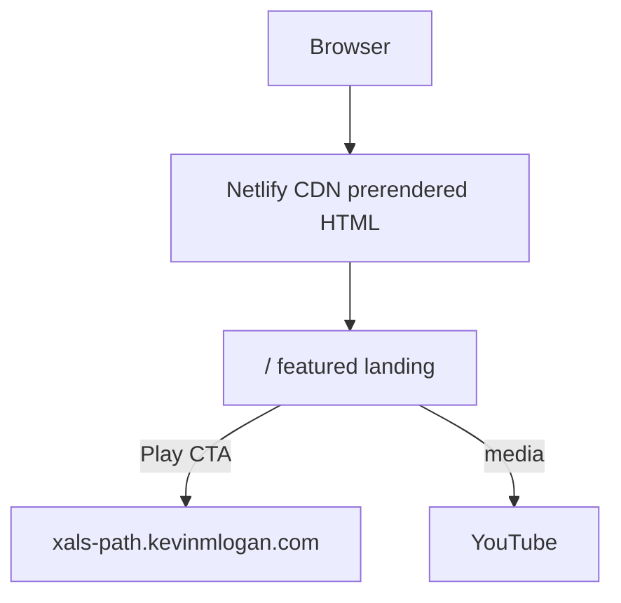
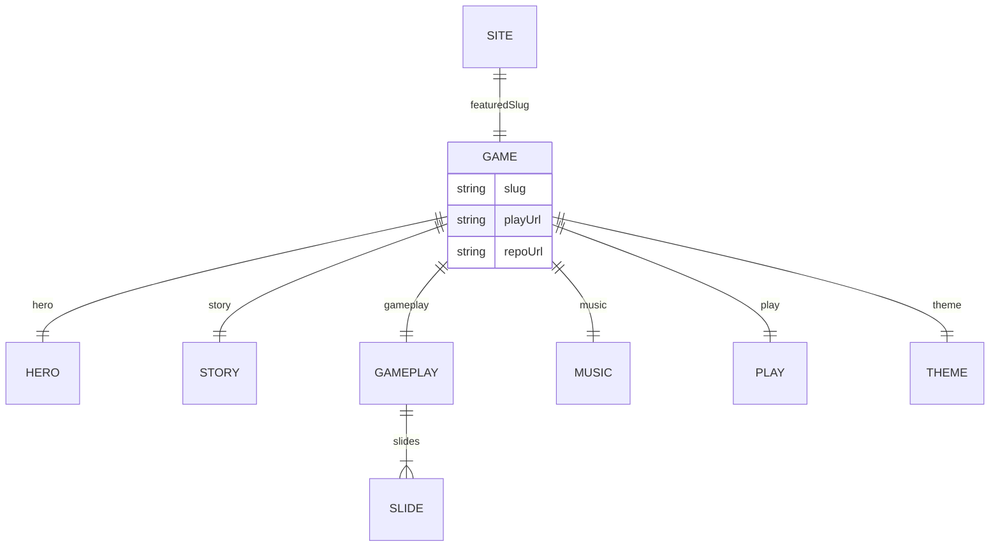

# Architecture Spine — Game Catalog

## Design Paradigm

**Content-driven themed storefront.** The catalog is a presentation layer over game records. The featured record owns the landing page's sections, copy, media, and visual tokens. The Phaser/Unity runtime stays in the game repo. Nuxt pages compose; they do not invent a second source of truth for a game.



## Invariants & Rules

### AD-1 — Featured landing is `/` [ADOPTED]

- **Binds:** routing, v1 homepage, later multi-game growth
- **Prevents:** a one-card studio index as the first impression; `/` and the featured game page drifting into two different products
- **Rule:** `/` renders the featured game's catalog page. v1 featured slug is `xals-path`. The featured slug is stored only in `app.config.ts` (`featuredSlug`). Game documents must not include a `featured` flag. Env must not override the slug in v1. A future `/games` index is additive; it does not replace `/` until `featuredSlug` is changed.

### AD-2 — Catalog does not run the game [ADOPTED]

- **Binds:** repo boundary, Play CTA, what may be imported
- **Prevents:** embedding Phaser, save state, or economy code in the catalog; coupling deploys of presentation and play
- **Rule:** this repo never hosts the play loop. `playUrl` on the game record is the only play handoff. v1 `playUrl` is `https://xals-path.kevinmlogan.com`. No package or path import from `kevinlogan94/xals-path`.

### AD-3 — One Content document per game [ADOPTED]

- **Binds:** copy, SEO, section payloads, play/trailer/music URLs
- **Prevents:** Xal's Path strings hardcoded in `index.vue` so a second game requires a rewrite
- **Rule:** games live under `content/games/`. The only Content read for the featured landing is `app/pages/index.vue` (or one composable it owns, used nowhere else). `Game*` components are props-only: they must not call `queryCollection`. Canonical copy lives in the document, not in Vue.

### AD-4 — Featured game owns the look [ADOPTED]

- **Binds:** theme tokens, type, section backgrounds, color mode
- **Prevents:** cloning the portfolio's blue/neutral resume chrome onto the catalog
- **Rule:** theme tokens on the game record are `theme.primary`, `theme.accent`, `theme.font`, `theme.colorMode` (`light` or `dark`, forced). `app/pages/index.vue` applies them once onto `UApp` / document CSS variables before sections render. Section components must not call `useColorMode`, must not inject stylesheets, and must not hardcode the meadow/dirt/purple palette as utilities. Per-section backgrounds are `public/` paths named on that section in Content.

### AD-5 — Kevin Logan brand, not Intrigue Games [ADOPTED]

- **Binds:** wordmark, footer, socials, legal line, asset provenance
- **Prevents:** presenting a studio the site no longer has rights to; pulling art from `intrigue-games.github.io`
- **Rule:** identity is Kevin Logan / games.kevinmlogan.com. No Intrigue logos, LLC copyright, or Intrigue social accounts. Visual assets come from `kevinlogan94/xals-path` (`develop`) or new files created for this repo.

### AD-6 — Dependency direction [ADOPTED]

- **Binds:** all catalog modules
- **Prevents:** components fetching ad-hoc URLs that bypass Content; pages importing game-repo code
- **Rule:** `app/pages` → `app/components` → `public/` files named by Content. Components do not read `content/` themselves. Game-specific outbound URLs (`playUrl`, `trailerUrl`, `soundtrackUrl`, `repoUrl`) live only on the game record. Site chrome URLs (portfolio, GitHub, X, email) live only in `app.config.ts`. No component may duplicate those literals.



### AD-7 — Netlify static catalog [ADOPTED]

- **Binds:** deploy, env, data stores
- **Prevents:** introducing Database/Blobs/Identity for a brochure site; SSR-only routes that cannot prerender
- **Rule:** Netlify production command is `pnpm generate`; publish directory is `.output/public`; `nitro.prerender.crawlLinks` is true. `NODE_VERSION` is `24`. v1 uses no Netlify Database, Blobs, Identity, or serverless functions required to render `/`. Secrets and analytics IDs live in Netlify env, never in git. Do not rely on Netlify's default `nuxt build` + Functions detection.

### AD-8 — Featured landing section contract [ADOPTED]

- **Binds:** `CATALOG-PAGE.md`, featured-game Content schema, nav anchors
- **Prevents:** dropping Play, reviving store "Coming Soon" as current availability, or inventing a different section set per builder
- **Rule:** a featured-game landing contains exactly these sections, in order: **Nav**, **Hero**, **Story**, **Gameplay**, **Music**, **Play**, **Footer**. Nav and Footer are layout chrome (`AppHeader` / `AppFooter`) fed props from `index.vue`; they are not extra Content queries and not `Game*` section bodies. Hero through Play are `Game*` bodies in `index.vue`. `playUrl` is required. The primary control label is **Play**, never **Download**. Historical store links may appear as history inside Play; they are not current CTAs. Nav wordmark is the featured game title; a secondary Kevin Logan control uses site config.

### AD-9 — Portfolio is a construction reference, not a skin [ADOPTED]

- **Binds:** starter choices, Content/SEO/prerender patterns
- **Prevents:** two competing Nuxt layouts (resume site vs game landing) mashed together
- **Rule:** reuse portfolio *engineering* (Nuxt Content collections, `useSeoMeta`, `UPage*` primitives, Motion, pnpm, Netlify prerender). Do not reuse portfolio *information architecture* (hero marquee of personal photos, work history, testimonials, engineer FAQ).

### AD-10 — Featured game document schema [ADOPTED]

- **Binds:** `content/games/*.yml`, Content collection schema, `index.vue` props
- **Prevents:** flat vs nested YAML forks; sections inventing their own field names
- **Rule:** each game document is one YAML file with this root shape (no alternate nesting): `slug`, `seo.title`, `seo.description`, `playUrl`, `repoUrl`, `hero` (`title`, `subtitle`, `pitch`, `trailerUrl`, `background`), `story` (`title`, `body`, `media`), `gameplay` (`title`, `slides` of `title`, `description`, `image`), `music` (`title`, `soundtrackUrl`, `background`), `play` (`title`, `body`, `desktopHint`, `mobileHint`), `theme` (`primary`, `accent`, `font`, `colorMode`). Extra keys are allowed; required keys are not renamed.

### AD-11 — Vendored catalog assets [ADOPTED]

- **Binds:** `public/games/<slug>/`, image/font references in Content
- **Prevents:** one builder copying into `public/` while another hotlinks GitHub raw or the live game CDN
- **Rule:** raster, gif, and font files used by the catalog are committed under `public/games/<slug>/`. Content media fields are site-root paths (`/games/xals-path/...`). Do not hotlink `github.com` or `raw.githubusercontent.com` for game art. Source files from `kevinlogan94/xals-path` `develop` (AD-5), then vendor them.

### AD-12 — Play is a web handoff, not a store download [ADOPTED]

- **Binds:** Hero/Nav/Play CTAs, `playUrl`, `play.desktopHint`, `play.mobileHint`
- **Prevents:** a fake Download that implies App Store/Play; catalog trying to A2HS a different origin; desktop and mobile sending people to two different products
- **Rule:** every Play control (nav, hero, Play section) opens the same `playUrl` in the browser. Desktop copy is `play.desktopHint` (play in the browser). Mobile copy is `play.mobileHint` (open the link, then Add to Home Screen for fullscreen). Show `desktopHint` at 768px and up, `mobileHint` below 768px; never two buttons or two URLs. The catalog must not call `beforeinstallprompt`, must not ship a second manifest for the game, and must not iframe the game to install it. Add-to-Home-Screen belongs to the game origin; Xal's Path already gates portrait phones in `installGate.ts`. Store listings are historical only.

## Consistency Conventions

| Concern | Convention |
| --- | --- |
| Naming | Game slug kebab-case matching repo when possible (`xals-path`). Content file `content/games/<slug>.yml`. Vue sections `GameHero`, `GameStory`, `GameGameplay`, `GameMusic`, `GamePlay`. Chrome: `AppHeader`, `AppFooter`. |
| Data | Dates ISO-8601. Play/trailer/soundtrack/repo URLs absolute HTTPS. Media paths site-root. IDs are slugs. Collection defined in `content.config.ts`. |
| State | Catalog is static; no client catalog store. Color mode is `theme.colorMode` on the featured document, applied once by `index.vue`. `play.desktopHint` vs `play.mobileHint` is CSS viewport (match the game's 768px phone/desktop split), not two destinations. |
| Config | `featuredSlug` and author/social/legal chrome only in `app.config.ts`. Game strings only in Content. |
| Package manager | pnpm; `packageManager` field from the Nuxt UI starter. |
| Commits | gitmoji shortcode prefix per repo convention. |

## Stack

Verified 2026-09-07 against npm and `nuxt-ui-templates/starter` `package.json`. Cold-start from `npm create nuxt@latest -- -t ui`, then add `@nuxt/content` (do not use `-t ui/landing` or `-t ui/portfolio` IA).

| Name | Version |
| --- | --- |
| Nuxt | 4.5.2 |
| @nuxt/ui | 4.11.0 |
| Tailwind CSS | 4.3.3 |
| @nuxt/content | 3.16.0 |
| TypeScript | 6.0.3 |
| pnpm | 11.24.0 |
| Node | 24 |
| Netlify | Git-linked; generate + `.output/public` |
| Starter | `npm create nuxt@latest -- -t ui` |

## Structural Seed

```text
games/
  app/
    app.vue              # UApp shell
    app.config.ts        # featuredSlug, chrome links
    assets/css/main.css  # @import tailwindcss + @nuxt/ui; game font hooks
    components/          # Game* landing sections + AppHeader/Footer
    pages/index.vue      # featured game landing; sole Content reader
    layouts/default.vue
  content/
    games/xals-path.yml
    content.config.ts    # games collection + AD-10 schema
  public/games/xals-path/
  nuxt.config.ts
  netlify.toml
  _bmad-output/planning-artifacts/architecture/
```





## Capability → Architecture Map

| Area | Lives in | Governed by |
| --- | --- | --- |
| Featured homepage | `app/pages/index.vue` | AD-1, AD-8, AD-10 |
| Game copy/media/URLs | `content/games/*.yml` | AD-3, AD-6, AD-10 |
| Themed sections | `app/components/Game*` | AD-4, AD-8 |
| Play handoff | `playUrl` + `play.*` hints | AD-2, AD-8, AD-12 |
| Brand/legal | `AppFooter` + `app.config.ts` | AD-5, AD-8 |
| Assets | `public/games/<slug>/` | AD-5, AD-11 |
| Deploy | `netlify.toml` + generate | AD-7 |
| Engineering patterns | Nuxt UI starter + portfolio | AD-9 |

## Deferred

- `/games` index and `/games/[slug]` — wait until a second game exists.
- Iframe or in-catalog Phaser mount — wait until a product reason beats "open playUrl".
- Netlify Database, Blobs, Identity, forms, required Functions — no dynamic catalog data in v1.
- Analytics vendor — optional `nuxt-gtag` after the site is live; ID in Netlify env.
- i18n, auth, user accounts.
- Changelog/blog on this host — portfolio already holds Xal's Path posts; link out if needed.
- Display font if PixelOperator cannot be licensed — `@nuxt/fonts` substitute, same pixel-RPG role; still named in `theme.font`.
- Catalog `?from=` query on `playUrl` so the game can tailor the install gate — only if the game repo adds it.
- `@nuxt/content` sqlite adapter — use Content 3.16 defaults on Node 24; do not copy portfolio `better-sqlite3` unless generate fails on Netlify.
